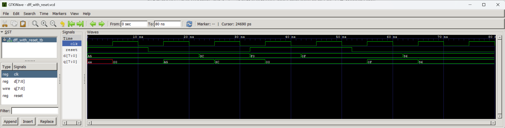

# DFF with Synchronous Reset Simulation

## Objective

In this experiment, I used a Verilog testbench to verify an 8-bit, positive-edge-triggered D flip-flop with an active-high synchronous reset.

## Tools

* Icarus Verilog
* GTKWave

## Test Cases

* Capture input data on a positive clock edge
* Hold the output between positive clock edges
* Assert and release the synchronous reset
* Test reset priority over the data input
* Capture new data after reset is released

## Waveform

## Observations

The waveform matched my predictions.

At 32 ns, `reset` changed from 0 to 1, but `q` did not change immediately. At the next positive clock edge at 35 ns, `q` became `00`. This shows that the reset is synchronous.

At the same 35 ns clock edge, `d` was `F0`, but `q` became `00` because reset had priority over the data input.

After reset was released, `q` captured `0F` at 55 ns and `96` at 65 ns.

## What I Learned

I learned that a synchronous reset only affects the output at the active clock edge. I also learned how to generate a clock and test inputs in a Verilog testbench, create a VCD file, and inspect the results in GTKWave.
