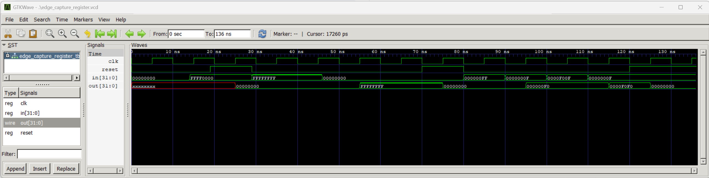

# Edge Capture Register Simulation

## Objective

The goal of this experiment was to simulate a 32-bit edge capture register. The circuit detects when an input bit changes from `1` to `0`. After a falling edge is captured, the matching output bit stays at `1` until the register is reset.

## Tools

- Icarus Verilog
- GTKWave

## Test Cases

1. **Synchronous reset**

   At the beginning of the simulation, `out` was unknown because the register had not been reset. When `reset` was high at the 25 ns rising clock edge, `out` changed to `00000000`.

2. **Full falling-edge capture**

   The input was set to `FFFFFFFF` and then changed to `00000000`. At the 55 ns rising clock edge, the register captured all 32 falling edges, so `out` became `FFFFFFFF`.

3. **Sticky output**

   The input remained at `00000000` for another clock cycle. At the 65 ns rising edge, `out` was still `FFFFFFFF`. This showed that captured bits stay set until reset.

4. **Partial falling-edge capture**

   The input changed from `000000FF` to `0000000F`. At the 95 ns rising edge, `out` became `000000F0` because only bits 7 through 4 had falling edges.

5. **Accumulated capture**

   The input was changed to `0000F00F` and sampled by the circuit. It was then changed back to `0000000F`. At the 115 ns rising edge, the new falling edges were added to the previous result, so `out` became `0000F0F0`.

6. **Final reset**

   Reset was asserted again at 120 ns. The output did not clear immediately. It changed to `00000000` at the next rising clock edge, showing that the reset is synchronous.

## Waveform

## Observations

- The circuit only checked the input at rising clock edges.
- A bit was captured when its previous value was `1` and its current value was `0`.
- Captured output bits stayed at `1` even when there were no new falling edges.
- Falling edges from different clock cycles accumulated in `out`.
- Reset only cleared the output at a rising clock edge.

## What I Learned

I learned how a register can remember whether an event happened in an earlier clock cycle. The circuit stores the previous input in `last` and compares it with the current input to find falling edges. I also learned why the output uses its previous value so that captured bits remain set until reset.