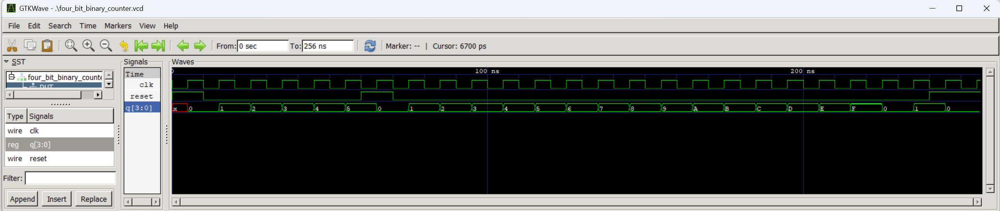

# Four-Bit Binary Counter Simulation

## Objective

The goal of this experiment was to simulate a four-bit binary counter. The counter increases by one at each rising clock edge when reset is low. Because it has four bits, it can count from `0` to `15` before returning to `0`.

## Tools

- Icarus Verilog
- GTKWave

## Test Cases

1. **Initial synchronous reset**

   At the beginning of the simulation, `q` was unknown because the counter had not reached a clock edge yet. Reset was high, so `q` changed to `0` at the first rising clock edge. This showed that the reset is synchronous.

2. **Basic counting**

   Reset was released, and the counter increased from `0` to `5`. The value of `q` changed only at rising clock edges.

3. **Reset during counting**

   Reset was asserted again after the counter reached `5`. The value did not change immediately. At the next rising clock edge, `q` returned to `0`.

4. **Full four-bit count and overflow**

   After reset was released again, the counter continued through the hexadecimal values `9`, `A`, `B`, `C`, `D`, `E`, and `F`. At the next rising clock edge, it returned from `F` to `0`. This verified the four-bit overflow behavior.

5. **Final reset**

   Reset was asserted one more time near the end of the simulation. At the next rising clock edge, `q` returned to `0` and stayed there for another clock cycle so the result was easy to see in the waveform.

## Waveform

## Observations

- The counter changed only at rising clock edges.
- When reset was low, the counter increased by one each clock cycle.
- The synchronous reset did not change `q` until a rising clock edge.
- A four-bit counter represents values from `0` to `15`.
- After reaching hexadecimal `F`, the counter returned to `0`.

## What I Learned

I learned how a binary counter stores and updates a value on each clock cycle. I also learned that a four-bit counter automatically returns to `0` after reaching `15` because it cannot store a larger value. This experiment helped me practice writing a testbench, testing a reset in the middle of a simulation, and checking counter overflow in GTKWave.